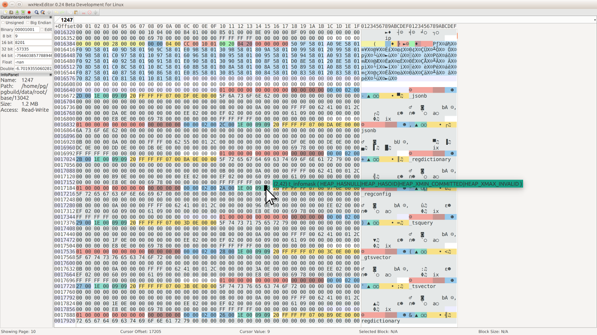

# pg_hexedit - Open PostgreSQL relation files in a hex editor with tags and annotations

Copyright (c) 2017-2018, VMware, Inc.

Copyright (c) 2002-2010, Red Hat, Inc.

Copyright (c) 2011-2018, PostgreSQL Global Development Group

Author: Peter Geoghegan [`<pg@bowt.ie>`](mailto:pg@bowt.ie)

pg_filedump author: Patrick Macdonald [`<patrickm@redhat.com>`](mailto:patrickm@redhat.com)

License: [GNU General Public License version 2](https://opensource.org/licenses/GPL-2.0)

Supported versions: PostgreSQL 9.4+

Supported platforms: Linux + libwxgtk (though MacOS probably also works)

## Overview

pg_hexedit is an experimental toolkit to format PostgreSQL heap, sequence, and
index files (B-Tree, GiST, GIN, hash, BRIN, and SP-GiST indexes) when opened
within the open source GUI hex editor
[wxHexEditor](https://github.com/EUA/wxHexEditor).  It makes viewing and
editing PostgreSQL relation files *significantly* easier.



__CAUTION:__ Do not use pg_hexedit with a PostgreSQL data directory if you are
not prepared to have it __corrupt data__!  pg_hexedit is primarily made
available for educational purposes.  It is an *experimental* tool, originally
used for simulating corruption/corruption analysis.

The type of file (heap/index) is determined automatically by the content of the
blocks within the file, using pg_filedump-style hueristics.  The default is to
format the entire file using the block size listed in block 0 as wxHexEditor
tag XML.  These defaults can be modified using run-time options.  However,
pg_hexedit is typically invoked using the packaged convenience scripts.

## Initial setup

### Building pg_hexedit

Note that pg_hexedit is a fork of
[pg_filedump](https://wiki.postgresql.org/wiki/Pg_filedump).  The pg_hexedit
executable, which is what actually generates wxHexEditor format XML, must be
built from source as a PostgreSQL frontend utility.

To compile pg_hexedit, you will need to have a properly configured
PostgreSQL source tree or complete install tree (with include files)
of the appropriate PostgreSQL major version.

The Makefile is a standalone makefile for pg_hexedit.  `pg_config` must be
available within your $PATH:

```shell
  $ which pg_config
  /code/postgresql/REL9_4_STABLE/install/bin/pg_config
  $ make
  $ # Installation -- not actually required for convenience scripts:
  $ make install
```

### Obtaining wxHexEditor

It is recommended that you build wxHexEditor's master branch from source.
There are general stability issues with wxHexEditor, especially with the tag
feature that pg_hexedit targets.  It's worth having all recent bug fixes. See:

[https://github.com/EUA/wxHexEditor](https://github.com/EUA/wxHexEditor)

It's generally only mildly inconvenient to build wxHexEditor on a modern
desktop Linux system.  On Debian-based systems with source repositories setup,
obtaining all build dependencies quickly should be straightforward:

```shell
  $ sudo apt-get build-dep wxhexeditor
  $ # (Install dependencies)
  $ sudo apt-get install libtool
```

Note that this doesn't actually install any wxHexEditor package, because we're
building wxHexEditor from source. It just installs the dependencies to build
the wxHexEditor source package, which, along with libtool, should be all we
need to build wxHexEditor from git tip.

See wxHexEditor docs for further instructions.

While wxHexEditor does have noticeable stability issues, these seem to be worth
working around, given the lack of any better alternative that is open source
and cross platform.

### wxHexEditor documentation

The [wxHexEditor wiki](http://wiki.wxhexeditor.org/index.php?title=Main_Page)
serves as wxHexEditor's user documentation.  It has some potentially useful
tips for getting the most out of the tool.

### Caret GTK+ bug

There appears to be a tendency for wxHexEditor's caret to fail to appear on a
mouse click event.  If this happens, you can work around it by changing the
Window that is highlighted within your desktop environment.

## Quickstart guide - Using the convenience scripts

### Requirements

pg_hexedit and wxHexEditor can be invoked using convenience scripts that take
care of everything.  These are designed to be run on a PostgreSQL backend
hacker's laptop, while the target PostgreSQL server is actually running.  The
server is queried to locate the relevant relation files.  The scripts also take
care of adding convenience offsets to the wxHexEditor cache, which can be used
to quickly locate internal pages of a B-Tree, for example.  The wxHexEditor
shortcut for accessing the offsets is Ctrl + G.

`psql` should be within your $PATH when the scripts are invoked. libpq
environment variables like $PGDATABASE can be set within the `hexedit.cfg`
file.  These control what database is opened by wxHexEditor, and other such
standard details.  Note that just like pg_filedump, pg_hexeditor has no
dependency on a running server, and is generally safer to use offline, despite
the fact that it is typically used online.  It is convenient to invoke
wxHexEditor using the scripts provided during analysis of *in situ* issues, or
when learning about PostgreSQL internals.

Having a PostgreSQL relfilenode file open in a hex editor __risks data
corruption__, especially when the PostgreSQL server is actually running
throughout.  The scripts were designed with backend development convenience in
mind, where __the database should only contain disposable test data__.

Convenience script requirements:

* The scripts are built on the assumption that they're invoked by a user that
  has the operating system level permissions needed to open PostgreSQL relation
  files, and Postgres superuser permissions.  The user invoking the script should
  have access to the same filesystem, through the same absolute paths. (Be very
  careful if the Postgres data directory is containerized; that's untested and
  unsupported.)

* Most convenience scripts rely on `CREATE EXTENSION IF NOT EXISTS pageinspect`
  running and making available various SQL-callable functions.  These functions
  are used to generate interesting offsets, or to display hints on index
  structure.  (This is highly recommended, but not actually required.)

[`contrib/pageinspect`](https://www.postgresql.org/docs/current/static/pageinspect.html)
must be available (the extensions supporting files must be installed) to use
the convenience scripts that depend on `contrib/pageinspect`.  Note that the
relation_hexedit script does not depend on `contrib/pageinspect`.
relation_hexedit is designed to work equally well with relations of any access
method, and uses simple convenience offsets (decile offsets).

To open the Postgres table `pg_type` with tags and annotations:

```shell
  # Should be invoked with CWD that finds pg_hexedit executable:
  $ pwd
  /home/pg/code/pg_hexedit
  # Confirm configuration:
  $ $EDITOR hexedit.cfg
  # Invoke generic script (works on tables and indexes):
  $ ./relation_hexedit pg_type
Replacing /home/pg/code/pg_hexedit/.wxHexEditor with pg_hexedit optimized settings...
...
```

To open the Postgres B-Tree `pg_type_typname_nsp_index` with tags and annotations:

```shell
  $ ./btree_hexedit pg_type_typname_nsp_index
Replacing /home/pg/code/pg_hexedit/.wxHexEditor with pg_hexedit optimized settings...
...
```

The advantage of using the btree_hexedit script for B-Tree indexes over the
generic relation_hexedit script is that btree_hexedit sets offsets for every
block that is a direct child of the root page.

There is also a gin_hexedit convenience script.  This does not set offsets
automatically.  Instead, it runs an SQL query that summarizes contiguous ranges
within the index based on block type (this is output to stdout).  Byte-wise
offsets are output, which may be manually input using the offsets dialog.  GIN
indexes are often made up of a fairly small number of contiguous ranges of a
single page type (e.g., 'data', 'leaf'), so a high level summary can help when
locating the section that is of interest.  Note that there might be
fragmentation (many distinct, smaller contiguous ranges) in uncommon cases.

The scripts will only open the first 1GB segment file in the relation.  Note
also that these convenience scripts limit the range of blocks that are
summarized, to keep the overhead acceptable.  (This can be changed by modifying
hexedit.cfg.)

Although only core index access methods are directly supported,
relation_hexedit may produce reasonably helpful tags and annotations for
user-defined index AMs, such as contrib/bloom.

If there is concurrent write activity by Postgres, the process of building XML
tags may error out before finishing.  In practice there is
unlikely to be trouble.  The scripts perform a `CHECKPOINT` before opening
relation files.

### Getting acceptable performance

While wxHexEditor compares favorably with other hex editors when tasked with
editing very large files, it appears to be far more likely to become
unresponsive when there are many tags.  It may be necessary to work around this
limitation at some point.

Generalize from the example of the convenience scripts for guidance on this.
Limiting the range that is summarized can be very effective in simple cases.

pg_hexedit's `-x` flag can be used to specify a page LSN before which pages
should not have tags emitted.  This is another option to reduce the overhead of
tags within wxHexEditor by avoiding generating tags for non-interesting
blocks/pages in the first place.  It can be useful during debugging to specify
an LSN that is only a few checkpoints old, to limit annotations to recently
modified blocks.  This advanced option isn't used by the convenience scripts.
[pg_waldump](https://www.postgresql.org/docs/current/static/pgwaldump.html) may
be used to find a relevant cutoff point's LSN value (e.g., based on a commit
WAL record's timestamp value).

pg_hexedit's `-l` flag can be used when the target is an nbtree relation.  This
will have pg_hexedit emit all-green, single-page tags for leaf pages, which are
less interesting than internal pages in some debugging scenarios.  This is yet
another option for limiting the number of tags generated to control overhead
within wxHexEditor.  This advanced option isn't currently used by the
convenience scripts.

## Direct invocation

pg_hexedit retains a minority of the flags that appear in pg_filedump.  Usage:

```shell
  pg_hexedit [options] file
```

Three new flags, `-x`, `-l`, and `-z`, have been added.  See `pg_hexedit -h`
for details of these and other flags.

Invoking pg_hexedit directly (not using convenience scripts) might be more
useful when you want to work on a copy of the database that is not under the
control of a running PostgreSQL server.

## Supporting other hex editors

While pg_hexedit targets wxHexEditor, it should not be difficult to adopt it to
other hex editors with a similar tag import feature if that becomes a
requirement in the future.

Actually generating raw tag output is confined to the following simple C
functions:

```
EmitXmlDocHeader()
EmitXmlFooter()
EmitXmlTag()
EmitXmlItemId()
EmitXmlTupleTag()
```

These routines could be changed to call a per-hexeditor callback.  Each
supported hex editor could have its own "provider" routines.

## Interpreting tuple contents with pageinspect

Because the pg_hexedit executable is a frontend utility that doesn't have
direct access to catalog metadata, tuple contents are not broken up into
multiple attribute/column tags.  The frontend utility has no way of determining
what the "shape" of tuples ought to be.

[`contrib/pageinspect`](https://www.postgresql.org/docs/current/static/pageinspect.html)
provides a solution -- it can split up the contents of the tuple further.

Suppose that you want to interpret the contents of the tuple for the `pg_type`
`int4` type's entry. This tuple (most columns omitted for brevity):

```sql
postgres=# select ctid, oid from  pg_type where typname = 'int4';
 ctid  | oid
-------+-----
 (0,8) |  23
(1 row)
```

We need to build a set of arguments to the pageinspect function
`tuple_data_split()`.  There are some subtleties that we go over now.

Copy all 140 bytes of the tuple contents within wxHexEditor into the system
clipboard (Ctrl + C). These are colored off-white or light gray.  Do not copy
header bytes, and do not copy the NUL bytes between the next tuple (alignment
padding), if any, which are *plain* white.

You should now be able to paste something close to the raw tuple contents
into a scratch buffer in your text editor.

`69 6E 74 34 00 00 ...` (Truncated for brevity.)

Copy and paste the "DataInterpreter" values for both `t_infomask2` and
`t_infomask` in plain decimal in the same scratch buffer file (N.B.: the
physical order of fields on the page *is* `t_infomask2` followed by
`t_infomask`, the opposite order to the order of corresponding
`tuple_data_split()` arguments).

You're probably using a little-endian machine (x86 is little-endian), and
that's what "DataInterpreter" will show as decimal by default.  Don't bother
trying to use bitstrings and integer casts (e.g. `SELECT x'1E00'::int4`),
because Postgres interprets that as having big-endian byte order, regardless of
the system's actual byte order.  It's best to just use interpreted decimal
values everywhere that an int4 argument is required.

Finally, we'll need to figure out a `t_bits` argument to give to
`tuple_data_split()`, which is a bit tricky with alignment considerations.
Putting it all together:

```sql
postgres=# SELECT tuple_data_split(
    rel_oid => 'pg_type'::regclass,
    t_data => E'\\x69 6E 74 34 00 00 00 00 00 00 00 00 00 00 00 00 00 00 00 00
00 00 00 00 00 00 00 00 00 00 00 00 00 00 00 00 00 00 00 00 00 00 00 00 00 00
00 00 00 00 00 00 00 00 00 00 00 00 00 00 00 00 00 00 0B 00 00 00 0A 00 00 00
04 00 01 62 4E 00 01 2C 00 00 00 00 00 00 00 00 EF 03 00 00 2A 00 00 00 2B 00
00 00 66 09 00 00 67 09 00 00 00 00 00 00 00 00 00 00 00 00 00 00 69 70 00 00
00 00 00 00 FF FF FF FF 00 00 00 00 00 00 00 00',
    t_infomask2 => 30,
    t_infomask => 2313,
    t_bits => '11111111111111111111111111100000');
```

This will return a bytea array, with one element per tuple.  Note that this
doesn't count the Oid value as an attribute, because it's a system column.
The first element returned in our `bytea` array is the name of the type,
`int4`.

## Areas that might be improved someday

* Support control files.

* Support MultiXact and CLOG/pg_xact SLRUs.

* Support full-page images from a WAL stream.

Possibly, this could be built on top of the `wal_consistency_checking` server
parameter that appeared in Postgres 10.  It looks like it wouldn't be very hard
to combine that with a hacked `pg_waldump`, whose `--bkp-details` option ouputs
different versions of the same block over time, for consumption by wxHexEditor.
(pg_waldump would only need to be customized to output raw data, rather than
generating the usual textual output; the rest could be scripted fairly easily).

Note that wxHexEditor has a "compare file" option that this could make use of.

With a bit more work, an abstraction could be built that allows the user to
travel back and forth in time to an arbitrary LSN, and to see a guaranteed
consistent image of the entire relation at that point.
