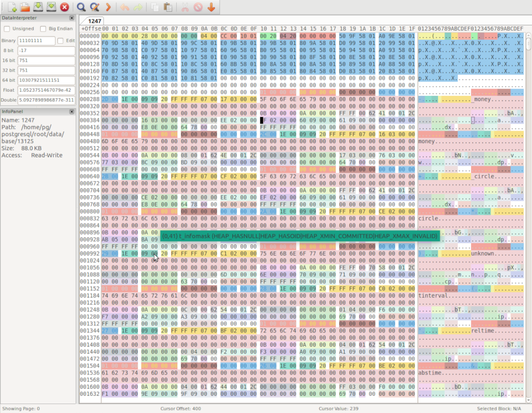
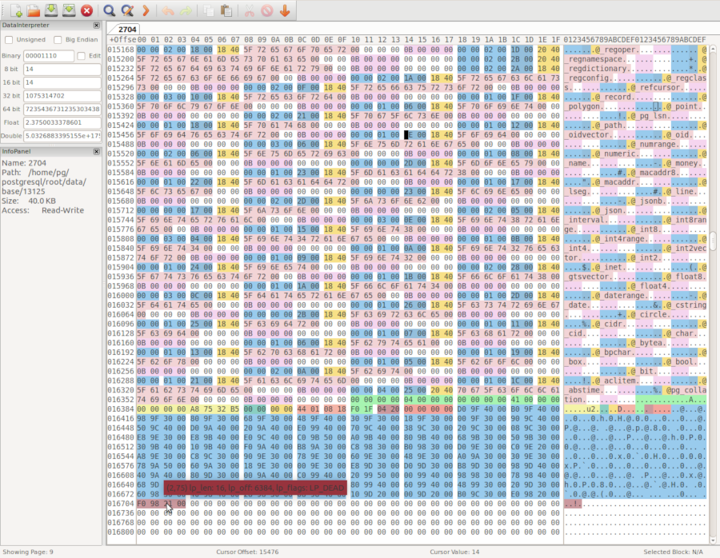

pg_hexedit
==========

## Open PostgreSQL relation files in a hex editor with tags and annotations

Copyright (c) 2017-2018, VMware, Inc.  
Copyright (c) 2002-2010, Red Hat, Inc.  
Copyright (c) 2011-2018, PostgreSQL Global Development Group

Author: Peter Geoghegan [`<pg@bowt.ie>`](mailto:pg@bowt.ie)  
Author (pg_filedump): Patrick Macdonald [`<patrickm@redhat.com>`](mailto:patrickm@redhat.com)

License: [GNU General Public License version 2](https://opensource.org/licenses/GPL-2.0)

## Overview

pg_hexedit is an experimental toolkit to format PostgreSQL heap, sequence, and
index files (B-Tree, GiST, GIN, hash, BRIN, and SP-GiST indexes) when opened
within the open source GUI hex editor
[wxHexEditor](https://github.com/EUA/wxHexEditor).  It makes viewing and
editing PostgreSQL relation files *significantly* easier.  PostgreSQL versions
9.4+ are supported.

__CAUTION:__ Do not use pg_hexedit with a PostgreSQL data directory if you are
not prepared to have it __corrupt data__!  pg_hexedit is primarily made
available for educational purposes.  It is an *experimental* tool, originally
used for simulating corruption/corruption analysis.

The type of each block (whether it's a heap block, B-Tree index block, or other
type of index block) is determined automatically based on the contents of the
page's special section.  Heuristics are used to identify the page type of each
and every block.  The block size listed in the first block found in the input
file is assumed for the entire file.


*wxHexEditor with pg_type system catalog table*


*wxHexEditor with pg_type_typname_nsp_index system catalog index*

## Initial setup

### Building pg_hexedit

Note that pg_hexedit is a fork of
[pg_filedump](https://wiki.postgresql.org/wiki/Pg_filedump).  The pg_hexedit
executable, which is what actually generates wxHexEditor format XML, must be
built from source as a PostgreSQL frontend utility.

To compile pg_hexedit, you will need to have a properly configured
PostgreSQL source tree or complete install tree (with include files)
of the appropriate PostgreSQL major version.

The Makefile is a standalone makefile for pg_hexedit.  `pg_config` must be
available within your $PATH:

```shell
  $ which pg_config
  /code/postgresql/REL9_4_STABLE/install/bin/pg_config
  $ make
  $ # Installation -- not actually required for convenience scripts:
  $ make install
```

### Obtaining wxHexEditor

It is highly recommended that you use wxHexEditor version 0.24 or higher, since
that version has numerous bug fixes for the tag feature that pg_hexedit
targets.  Packages are available for all major platforms from Sourceforge:

[https://sourceforge.net/projects/wxhexeditor/](https://sourceforge.net/projects/wxhexeditor/)

If using those packages is not an option, there may be no conveniently
available packages for wxHexEditor 0.24 from your system package manager.  The
most practical option may be to build wxHexEditor's master branch from source.
See:

[https://github.com/EUA/wxHexEditor](https://github.com/EUA/wxHexEditor)

It's generally only mildly inconvenient to build wxHexEditor on a modern
desktop Linux system.  On Debian-based systems with source repositories set up,
obtaining all build dependencies quickly should be straightforward:

```shell
  $ sudo apt-get build-dep wxhexeditor
  $ # (Install dependencies)
  $ sudo apt-get install libtool
```

Note that this doesn't actually install any wxHexEditor package, because we're
building wxHexEditor from source. It just installs the dependencies to build
the wxHexEditor source package, which, along with libtool, should be all we
need to build wxHexEditor from git tip.

See wxHexEditor docs for further instructions.

While wxHexEditor does have noticeable stability issues, these seem to be worth
working around, given the lack of any better alternative that is open source
and cross platform.

### wxHexEditor documentation

The [wxHexEditor wiki](http://wiki.wxhexeditor.org/index.php?title=Main_Page)
serves as wxHexEditor's user documentation.  It has some potentially useful
tips for getting the most out of the tool.

### Caret GTK+ bug

There appears to be a tendency for wxHexEditor's caret to fail to appear on a
mouse click event.  If this happens, you can work around it by changing the
Window that is highlighted within your desktop environment.

## Quickstart guide - Using the convenience scripts

### Requirements

pg_hexedit and wxHexEditor can be invoked using convenience scripts that take
care of everything.  These are designed to be run on a PostgreSQL backend
hacker's laptop, while the target PostgreSQL server is actually running.  The
server is queried to locate the relevant relation files.  The scripts also take
care of adding convenience offsets to the wxHexEditor cache, which can be used
to quickly locate internal pages of a B-Tree, for example.  The wxHexEditor
shortcut for accessing the offsets is Ctrl + G.

`psql` should be within your $PATH when the scripts are invoked. libpq
environment variables like $PGDATABASE can be set within the `hexedit.cfg`
file.  These control what database is opened by wxHexEditor, and other such
standard details.  Note that just like pg_filedump, pg_hexeditor has no
dependency on a running server, and is generally safer to use offline, despite
the fact that it is typically used online.  It is convenient to invoke
wxHexEditor using the scripts provided during analysis of *in situ* issues, or
when learning about PostgreSQL internals.

Having a PostgreSQL relfilenode file open in a hex editor __risks data
corruption__, especially when the PostgreSQL server is actually running
throughout.  The scripts were designed with backend development convenience in
mind, where __the database should only contain disposable test data__.

Convenience script assumptions:

* The scripts assume that they're run as an OS user that has the operating
  system level permissions needed to open/read all PostgreSQL relation files,
  using the same absolute paths as PostgreSQL.  Be very careful if the Postgres
  data directory is containerized; a convenience script might open relation
  files from an unrelated installation if this assumption is not fully met.

* Most convenience scripts rely on `CREATE EXTENSION IF NOT EXISTS pageinspect`
  running and making available various SQL-callable functions.  These functions
  are used to generate interesting offsets, or to display hints on index
  structure.  (This is highly recommended, but not actually required.)

* `psql` must connect using a PostgreSQL role with superuser permissions.  This
  is needed to determine the path of Postgres relfiles (and to install
  `contrib/pageinspect`).

[`contrib/pageinspect`](https://www.postgresql.org/docs/current/static/pageinspect.html)
must be available (the extensions supporting files must be installed) to use
the convenience scripts that depend on `contrib/pageinspect`.  Note that the
relation_hexedit script does not depend on `contrib/pageinspect`.
relation_hexedit is designed to work equally well with relations of any access
method, and uses simple convenience offsets (decile offsets).

To open the Postgres table `pg_type` with tags and annotations:

```shell
  # Should be invoked with CWD that finds pg_hexedit executable:
  $ pwd
  /home/pg/code/pg_hexedit
  # Confirm configuration:
  $ $EDITOR hexedit.cfg
  # Invoke generic script (works on tables and indexes):
  $ ./relation_hexedit pg_type
Replacing /home/pg/code/pg_hexedit/.wxHexEditor with pg_hexedit optimized settings...
...
```

To open the Postgres B-Tree `pg_type_typname_nsp_index` with tags and annotations:

```shell
  $ ./btree_hexedit pg_type_typname_nsp_index
Replacing /home/pg/code/pg_hexedit/.wxHexEditor with pg_hexedit optimized settings...
...
```

The advantage of using the btree_hexedit script for B-Tree indexes over the
generic relation_hexedit script is that btree_hexedit sets offsets for every
non-leaf block that is a direct child of the root page (and for the root page
itself).

There is also a gin_hexedit convenience script.  This does not set offsets
automatically.  Instead, it runs an SQL query that summarizes contiguous ranges
within the index based on block type (this is output to stdout).  Byte-wise
offsets are output, which may be manually input using the offsets dialog.  GIN
indexes are often made up of a fairly small number of contiguous ranges of a
single page type (e.g., 'data', 'leaf'), so a high level summary can help when
locating the section that is of interest.  Note that there might be
fragmentation (many distinct, smaller contiguous ranges) in uncommon cases.

The scripts will only open the first 1GB segment file in the relation.  Note
also that these convenience scripts limit the range of blocks that are
summarized, to keep the overhead acceptable.  (This can be changed by modifying
hexedit.cfg.)

If there is concurrent write activity by Postgres, the process of building XML
tags may error out before finishing.  In practice there is
unlikely to be trouble.  The scripts perform a `CHECKPOINT` before opening
relation files.

### Getting acceptable performance

While wxHexEditor compares favorably with other hex editors when tasked with
editing very large files, it appears to be far more likely to become
unresponsive when there are many tags.  It may be necessary to work around this
limitation at some point.

Generalize from the example of the convenience scripts for guidance on this.
Limiting the range that is summarized can be very effective in simple cases.

pg_hexedit's `-x` flag can be used to specify a page LSN before which pages
should not have tags emitted.  This is another option to reduce the overhead of
tags within wxHexEditor by avoiding generating tags for non-interesting
blocks/pages in the first place.  It can be useful during debugging to specify
an LSN that is only a few checkpoints old, to limit annotations to recently
modified blocks.  This advanced option isn't used by the convenience scripts.
[pg_waldump](https://www.postgresql.org/docs/current/static/pgwaldump.html) may
be used to find a relevant cutoff point's LSN value (e.g., based on a commit
WAL record's timestamp value).

pg_hexedit's `-l` flag can be used when the target is an nbtree relation.  This
will have pg_hexedit emit all-green, single-page tags for leaf pages, which are
less interesting than internal pages in some debugging scenarios.  This is yet
another option for limiting the number of tags generated to control overhead
within wxHexEditor.  This advanced option isn't currently used by the
convenience scripts.

## Direct invocation

Invoking pg_hexedit directly (not using convenience scripts) is useful when you
want to work on a copy of the database that is not under the control of a
running PostgreSQL server, or when a psql connection to the running PostgreSQL
server cannot be established.  pg_hexedit should have stdout redirected to a
file.  wxHexEditor will automatically open tags for a target file when it is
opened and a tag file is found in the same directory (provided the tag file has
the same name as the target file with a ".tags" extension postfixed).
Alternatively, tags can be directly imported once wxHexEditor has opened a
file.

pg_hexedit retains a minority of the flags that appear in pg_filedump.  Usage:

```shell
  pg_hexedit [options] file
```

The `-D` flag can be used to decode tuples.  The flag should be followed by a
tuple descriptor string in pg_hexedit's "attrlist" format.  Decoding allows
pg_hexedit to generate distinct tags for each user attribute/column value in
each tuple, rather than just creating a single tag for all column data within
each tuple.  The attrlist format consists of a list with an entry for each
pg_attribute entry's attlen, attname, and attalign, which should be specified
as:

`-D 'attlen,attname,attalign,attlen,attname,attalign,...'`

Each attribute's triple of metadata should appear in pg_attribute.attnum order.
The convenience scripts use an SQL query to form the string.  The attrlist SQL
query will produce a correct `-D` argument when run against a relation with the
same schema as the target relation/file, even when run against an unrelated
PostgreSQL installation, provided a compatible CPU architecture is used.  Note
that dropped columns need to be represented in the attrlist string.  Elements
that contain whitespace or comma characters can be parsed as a single element
by appearing within double quotes.  It's good practice to use single quotes for
the attrlist argument as a whole.

See `pg_hexedit -h` for full details of all available options.

### Determining catalog relation file mappings without a database connection

pg_filenodemapdata is a program that prints the contents of a specified catalog
relation to relfile mapping (pg_filenode.map) file.  It is distributed with
pg_hexedit.  pg_filenodemapdata can be used to determine which system catalog
relfiles to examine in cases where a database connection cannot be established
due to severe system catalog corruption.  It's usually easier to figure this
out using the generic SQL-based approach that the convenience scripts take, but
that isn't always possible.

To print the mappings for the database with pg_database OID 12389 (and
verify the pg_filenode.map checksum in passing):

```shell
  $ cd $PGDATA
  $ pg_filenodemapdata base/12389/pg_filenode.map
    magic:               0x00592717
    num_mappings:        15

     0) 1259 - pg_class:                                  1259
     1) 1249 - pg_attribute:                              1249
     2) 1255 - pg_proc:                                   1255
     3) 1247 - pg_type:                                   1247
     4) 2836 - pg_toast_1255:                             2836
     5) 2837 - pg_toast_1255_index:                       2837
     6) 2658 - pg_attribute_relid_attnam_index:           2658
     7) 2659 - pg_attribute_relid_attnum_index:           2659
     8) 2662 - pg_class_oid_index:                        2662
     9) 2663 - pg_class_relname_nsp_index:                2663
    10) 3455 - pg_class_tblspc_relfilenode_index:         3455
    11) 2690 - pg_proc_oid_index:                         2690
    12) 2691 - pg_proc_proname_args_nsp_index:            2691
    13) 2703 - pg_type_oid_index:                         2703
    14) 2704 - pg_type_typname_nsp_index:                 2704

    file checksum:       0x3AA59965
```

In this example, all mapped system catalog relations within the database have
relfilenode numbers that match their universal, fixed pg_class OID identifiers.
This is often not the case, though.  Operations like VACUUM FULL will assign a
new relfilenode to the target table relation, and to all associated index
relations.

Installations with many small databases may require an additional step.  It may
be unclear which subdirectory of the base directory corresponds to a database
that happens to be of interest.  The relevant metadata is stored in the
pg_database *shared* system catalog: the names of base subdirectories
correspond to a pg_database entry OID.  The location of the relfile for the
global pg_database table might need to be determined first, so that a
particular base directory can be identified:

```shell
  $ pg_filenodemapdata global/pg_filenode.map | grep pg_database
     0) 1262 - pg_database:                               1262
    21) 2671 - pg_database_datname_index:                 2671
    22) 2672 - pg_database_oid_index:                     2672
```

The file global/1262 can now be opened using wxHexEditor, to examine the
contents of pg_database.  pg_database tuples contain a database name, so it
should be possible to search for the entry of interest using the wxHexEditor
search dialog.  The OID for each tuple/database is a 4 byte unsigned integer
that is embedded at the end of the t_bits field, immediately before the
beginning of the tuple contents proper.

## Supporting other hex editors

While pg_hexedit targets wxHexEditor, it should not be difficult to adopt it to
other hex editors with a similar tag import feature if that becomes a
requirement in the future.

Actually generating raw tag output is confined to the following simple C
functions:

```
EmitXmlDocHeader()
EmitXmlFooter()
EmitXmlTag()
EmitXmlItemId()
EmitXmlTupleTag()
```

These routines could be changed to call a per-hexeditor callback.  Each
supported hex editor could have its own "provider" routines.

## Areas that might be improved someday

* Support control files.

* Support MultiXact and CLOG/pg_xact SLRUs.

* Support full-page images from a WAL stream.

Possibly, this could be built on top of the `wal_consistency_checking` server
parameter that appeared in Postgres 10.  It looks like it wouldn't be very hard
to combine that with a hacked `pg_waldump`, whose `--bkp-details` option ouputs
different versions of the same block over time, for consumption by wxHexEditor.
(pg_waldump would only need to be customized to output raw data, rather than
generating the usual textual output; the rest could be scripted fairly easily).

Note that wxHexEditor has a "compare file" option that this could make use of.

With a bit more work, an abstraction could be built that allows the user to
travel back and forth in time to an arbitrary LSN, and to see a guaranteed
consistent image of the entire relation at that point.
